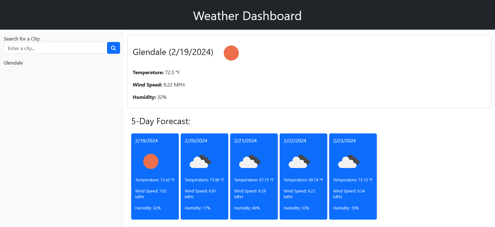

# Weather Dashboard

## Table of Contents

- [About](#about)
- [Usage](#usage)
- [Contributing](#contributing)
- [Credits](#credits)
- [License](#license)

## About

Built a weather dashboard that runs in the browser and features dynamically updated HTML and CSS. Uses the [5 Day Weather Forecast](https://openweathermap.org/forecast5) to retrieve weather data for cities.

## Usage

[Link to website](https://gurleyryan.github.io/weather-dashboard/)

Search for a city in the top left search bar. The current weather and future forecast will display on the right. Your search will also be saved in a search history list on the left.

## Contributing

Contributors:  

- [Ryan Gurley](https://github.com/gurleyryan)

## Credits

External Sources:  
- [Font Awesome for Weather Icons](https://fontawesome.com/)  
- [OpenWeather for Weather Data](https://openweathermap.org/forecast5)  
- [Bootstrap](https://getbootstrap.com/)

## License

Please refer to the [LICENSE](https://github.com/gurleyryan/weather-dashboard?tab=MIT-1-ov-file) in the repo.
